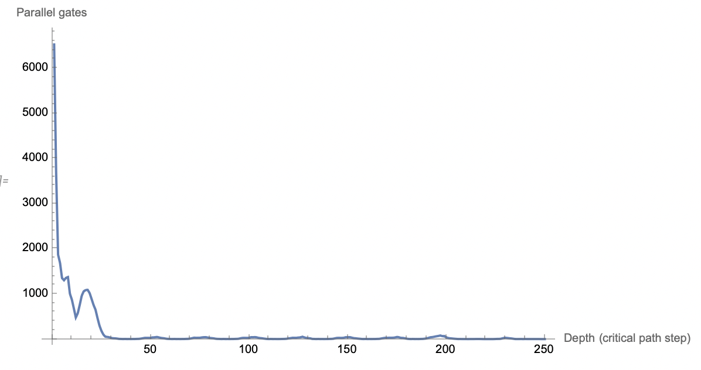
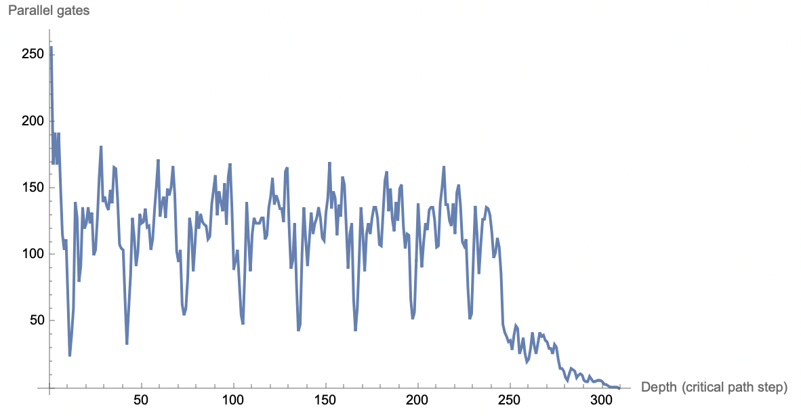

# Brent-Optimal Scheduling for Parallel Execution of Fixed-Topology Boolean Circuits

Is it possible to improve performance without altering the circuit, merely reorder?

## Objective

Preprocess existing Boolean circuit files[3]. This involves constructing the dependency DAG, computing the depth of every node to determine the critical path, and organizing gates into execution layers. Logical equivalence to the original circuit is preserved exactly.

## Engine

We assume an execution engine with the scheduling strategy as follows.

Each line in the circuit file defines a gate with explicit input and output wire indices. A gate becomes eligible for execution as soon as its dependencies are satisfied. No speculative execution, gate fusion, algebraic simplification, or structural rewriting of the circuit is performed.

## Brent's Theorem

The performance of parallel execution is constrained by two factors: the average computational load per processor, represented by 𝑊 / 𝑃, and the critical path length 𝐷. Even with perfect scheduling, the circuit depth imposes a hard lower bound on runtime.

$$
\displaystyle
T_P \le \frac{W}{P} + D
$$
where
$$
\begin{aligned}
T_P &= \text{execution time using } P \text{ processors} \\
W   &= \text{total work (total number of gate evaluations)} \\
P   &= \text{number of parallel worker threads (or processors)} \\
D   &= \text{circuit depth (critical path length)}
\end{aligned}
$$

(Gate evaluation cost is assumed to be uniform, which aligns with the work–depth model used in Brent’s theorem. Memory access, synchronization, and thread dispatch overhead are assumed to be bounded and small relative to gate execution cost, which is typically valid in FHE settings.)

## Algorithm Overview
Parse the circuit. For each input-to-output relationship, a directed edge is added from the input node to the output node. Two adjacency structures are maintained, one mapping each node to its parents and another mapping each node to its children. 

Compute node depths, which correspond to critical path levels. Input nodes have depth zero. For any other node, its depth is defined as one plus the maximum depth of its parents. This computation proceeds in topological order so that all parent depths are known before a node’s depth is computed. The maximum depth over all nodes yields the circuit’s critical path length 𝐷.

The third step is levelization. Nodes are grouped by their computed depth. Each group corresponds to a level in which all gates depend only on results from earlier levels. Therefore, all gates within a single level can be evaluated in parallel without violating dependencies.

The fourth step applies Brent-style scheduling for a finite number of processors 𝑃. If a level contains more than 𝑃 gates, it is processed in batches, each containing at most 𝑃 gates. Each batch is executed in parallel, and batches within the same level are processed sequentially. The total runtime becomes the sum, over all levels, of the number of required batches.

### Core Procedures

* Depth computation begins by obtaining a topological ordering of the graph. For each node in that order, its depth is set to zero if it has no parents. Otherwise, its depth is assigned as one plus the maximum depth among its parent nodes.

* Parallel evaluation proceeds by iterating through the levels in increasing depth order. For each level, the nodes are partitioned into groups of size at most 𝑃. Each group is evaluated in parallel, and groups are processed one after another until the level is complete.

## Summary

In large Boolean circuits such as those used for AES, the total gate count 𝑊 is high, while the depth 𝐷 is moderate. Many levels contain substantial parallel width, making them well suited for Brent-style scheduling. This approach enables predictable scaling, efficient utilization of CPU cores, and safe parallel execution without violating gate dependencies.

## Benchmarks

See [4] and [5] for engines supporting the format specified in [2].

Trials using engine[4] and AES circuit from [2]:

| Logical CPUs | Stage                | bc Time (s) | Speedup |
|--------------|----------------------|-------------|---------|
| 16           |                      | 58.41       | 1.00×   |
| 112          |                      | 25.63       |         |
| 16           | After preprocessing  | 28.83       | 2.03×   |

Table 1. Run on AMD Milan.

| Logical CPUs | Stage                | bc Time (s) | Speedup |
|--------------|----------------------|-------------|---------|
| 5            |                      | 156.07      | 1.00×   |
| 5            | After preprocessing  | 99.27       | 1.57×   |

Table 2. Run on Apple M1.

## Parallel execution bandwidth profile

Figure 1.

Figure 2.

## References
[1][Analysis of parallel algorithms — Wikipedia](https://en.wikipedia.org/wiki/Analysis_of_parallel_algorithms)

[2]['Bristol Fashion' MPC Circuits](https://nigelsmart.github.io/MPC-Circuits/)

[3][Directed acyclic graph](https://en.wikipedia.org/wiki/Directed_acyclic_graph)

[4][tfhe-rs-examples/aes_128_threads](https://github.com/CryptoPenguin15/tfhe-rs-examples/tree/main/aes_128_threads)

[5][tomtau/fhe-aes](https://github.com/tomtau/fhe-aes)

